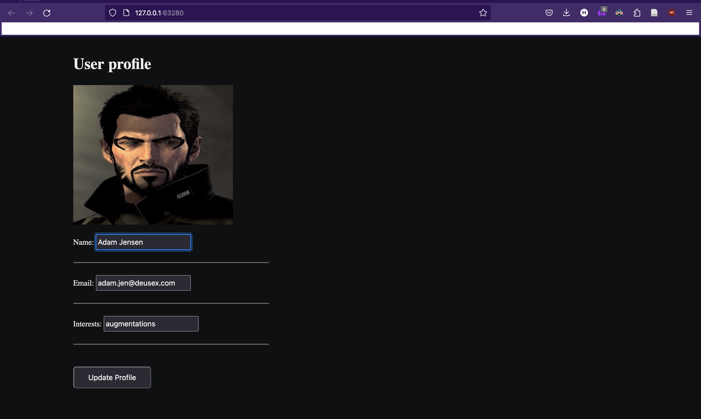
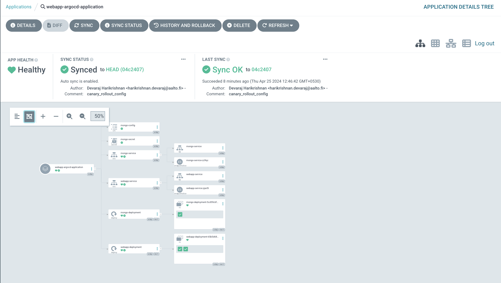
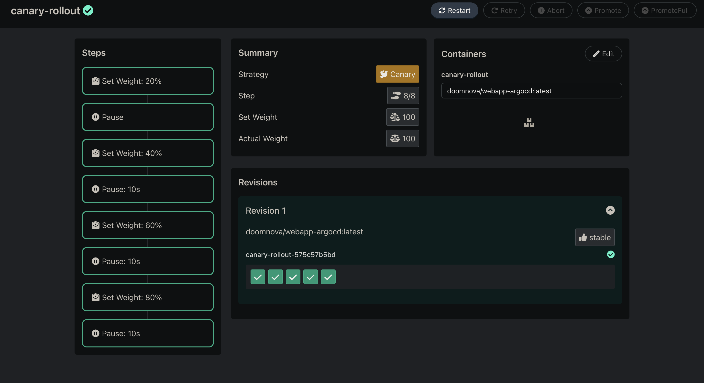
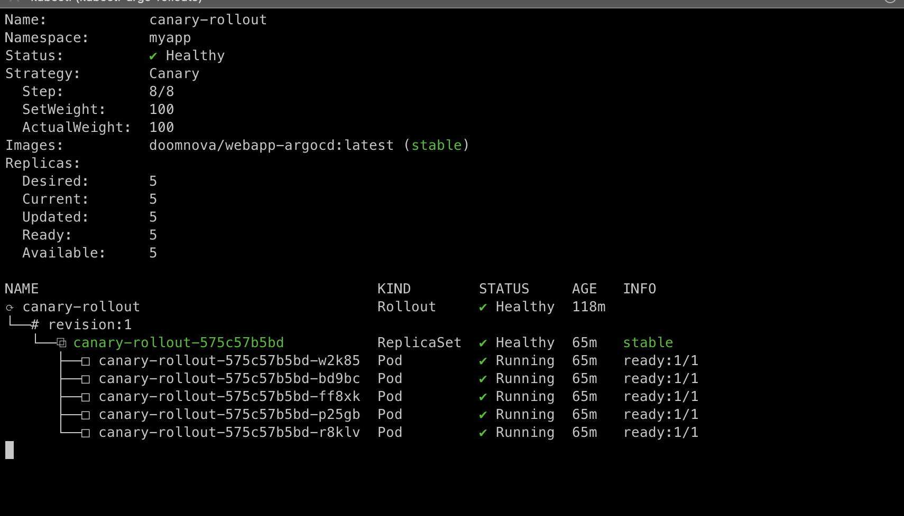
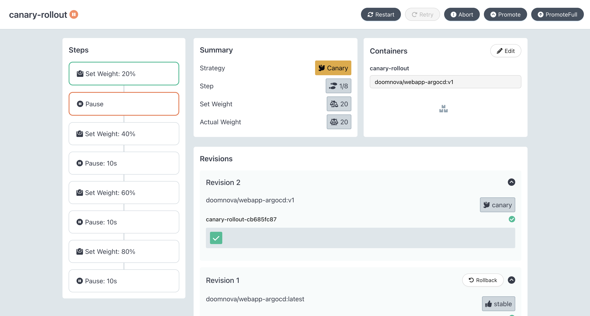
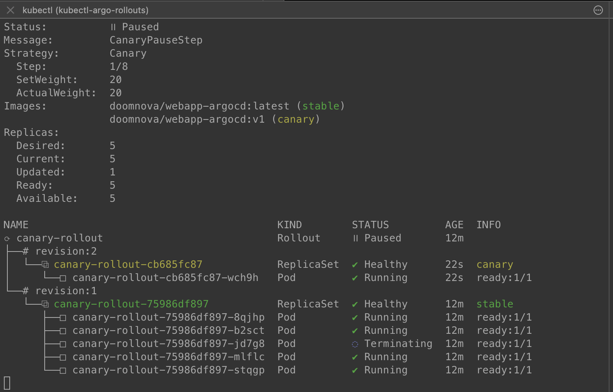
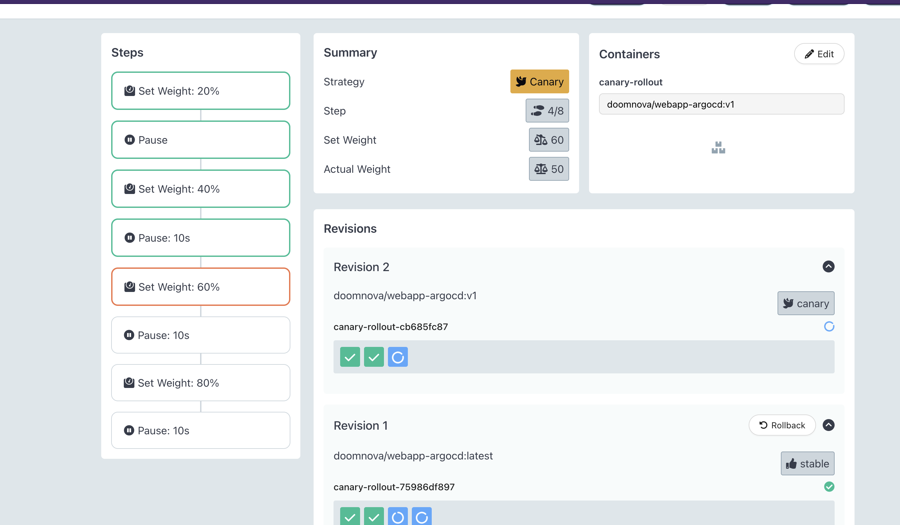
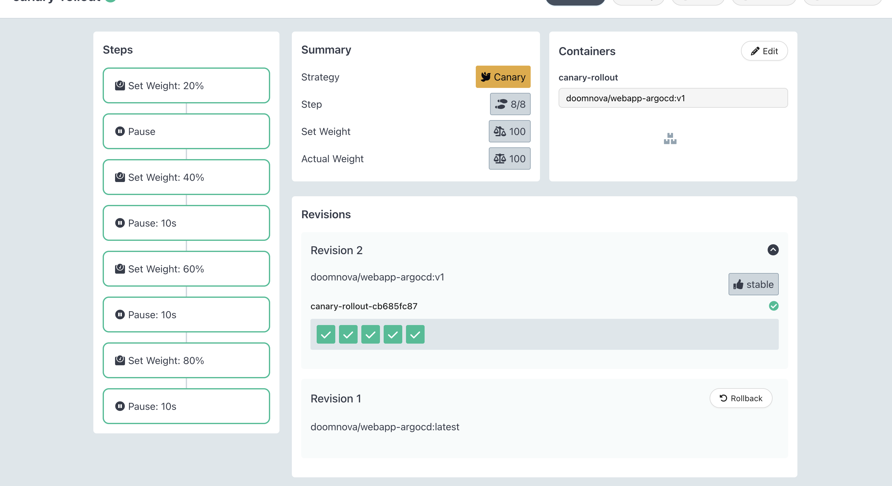
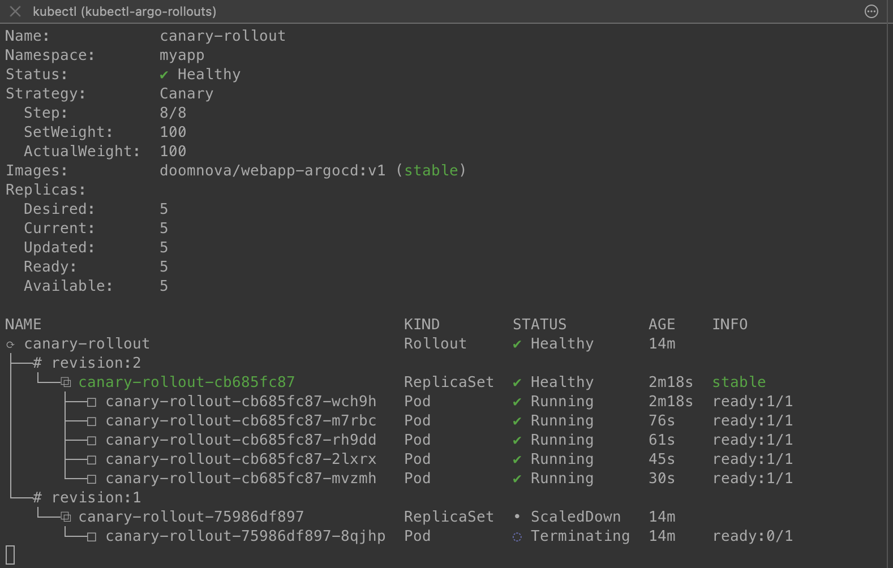
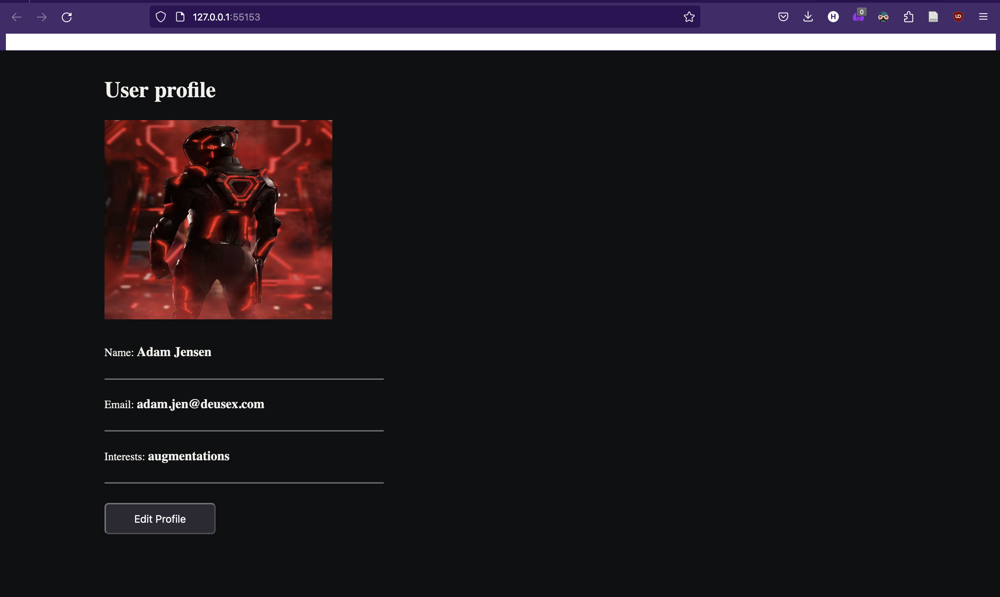

<!-- Improved compatibility of back to top link: See: https://github.com/othneildrew/Best-README-Template/pull/73 -->
<a name="readme-top"></a>
<!--
*** Thanks for checking out the Best-README-Template. If you have a suggestion
*** that would make this better, please fork the repo and create a pull request
*** or simply open an issue with the tag "enhancement".
*** Don't forget to give the project a star!
*** Thanks again! Now go create something AMAZING! :D
-->


<!-- PROJECT SHIELDS -->
<!--
*** I'm using markdown "reference style" links for readability.
*** Reference links are enclosed in brackets [ ] instead of parentheses ( ).
*** See the bottom of this document for the declaration of the reference variables
*** for contributors-url, forks-url, etc. This is an optional, concise syntax you may use.
*** https://www.markdownguide.org/basic-syntax/#reference-style-links
-->
<!--[![Contributors][contributors-shield]][contributors-url]
[![Forks][forks-shield]][forks-url]
[![Stargazers][stars-shield]][stars-url]
[![Issues][issues-shield]][issues-url]
[![MIT License][license-shield]][license-url]
[![LinkedIn][linkedin-shield]][linkedin-url]-->


<!-- PROJECT LOGO -->
<br />
<div align="center">
  

<h3 align="center">Webapp using Argo CD</h3>

  <p align="center">
    This repo includes the source code and the github workflow file to generate the docker hub image for the web application. The kubernetes config files repo for this source code are available in the link below:
    <br />
    <a href="https://github.com/DOOMNOVA/A_P_config_argocd.git"><strong>Config File repo »</strong></a>
    <br />
    <br />
   
  </p>
</div>


<!-- TABLE OF CONTENTS -->
<details>
  <summary>Table of Contents</summary>
  <ol>
    <li>
      <a href="#about-the-project">About The Project</a>
      <ul>
        <li><a href="#built-with">Built With</a></li>
      </ul>
    </li>
    <li>
      <a href="#prerequisites and installation">Prerequisites and Installation</a>
    </li>
    <li><a href="#Steps Involved - Without Argo Rollouts">Steps Involved - Without Argo Rollouts </a></
    <li><a href="#Results - Without Argo Rollouts">Results - Without Argo Rollouts</a></li>
     <li><a href="#Steps Involved - With Argo Rollouts">Steps Involved - With Argo Rollouts </a></
    <li><a href="#Results - Without Argo Rollouts">Results - Without Argo Rollouts</a></li>
    <li><a href="#Clean up resources">Clean up resources</a></li>
    <li><a href="#license">License</a></li>
    <li><a href="References">References</a></li>
  </ol>
</details>


<!-- ABOUT THE PROJECT -->
## About The Project

In this project, a simple profile page with a `MongoDB` database is used to understand the principles of `Gitops` with `Argo CD`. The webapp is dockerized, deployed  to a `Minikube` Kubernetes cluster using `Argo CD`, and its release process is managed with `Argo Rollouts`. A `Canary` release strategy is implemented using a new docker image of the webapp and its results are show in the following sections. Further, the `Kubernetes` Config files are stored in a different github repo for easing the complexity of the CD pipeline and it is a good practice according to the `Argo CD` docs.  
 So, this project consists of three main tasks: setup and configuration, creating the GitOps pipeline and finally implementing a Canary release.




<p align="right">(<a href="#readme-top">back to top</a>)</p>


### Built With

* [![Kubernetes][Kubernetes.io]][Kubernetes-url]
* [![Docker][Docker.com]][Docker-url]
* [![MongoDB][MongoDB.com]][MongoDB-url]
* [![JavaScript][JavaScript.com]][JavaScript-url]

<p align="right">(<a href="#readme-top">back to top</a>)</p>


<!-- GETTING STARTED -->
### Prerequisites and Installation

 The below points describe the key installations that is needed to run this project:
* The installation of `Kubernetes` or 'kubectl' and `Docker` can be followed from their official websites links given in the above section. 
* For installing the `Minikube` cluster on my local machine, I have followed the steps from the [official documentation](https://minikube.sigs.k8s.io/docs/start/). In this project, I have used the cluster as a container, so the driver I am using to start the cluster is `Docker`.
* Next in the `Minikube`cluster, Argo CD is installed following the [official documentation](https://argo-cd.readthedocs.io/en/stable/getting_started/). 
* Since one of the aims of this project is to include a canary release strategy, Argo Rollouts is also installed in the cluster following the [official documentation](https://github.com/argoproj/argo-rollouts/blob/master/docs/installation.md#kubectl-plugin-installation). I have also installed the Kubectl plugin, so that it is possible to visualize and manage the plugins from the command line.
In the next section, the steps involved to create this project is defined.
<!-- * npm
  ```sh
  npm install npm@latest -g
  ```

### Installation

1. Get a free API Key at [https://example.com](https://example.com)
2. Clone the repo
   ```sh
   git clone https://github.com/DOOMNOVA/A_p_test.git
   ```
3. Install NPM packages
   ```sh
   npm install
   ```
4. Enter your API in `config.js`
   ```js
   const API_KEY = 'ENTER YOUR API';
   ``` -->
## Steps Involved - Without Argo Rollouts
* The initial step involves pushing a docker container image of the web application to `DockerHub`. So, the docker files - `Dockerfile` and`docker-compose.yaml` is created. Further, in order to streamline the process a github actions workflow file - `main.yaml` is created to push a new image to `DockerHub` everytime there is change to this source code repo.

* Next in the `Minikube` cluster I have initially created, a new namespace `myapp` is created for the web application and the config files will be run inside this. The Kubernetics manifest files in the  [Config repo](https://github.com/DOOMNOVA/A_P_config_argocd.git) uses the image - `doomnova/webapp-argocd:latest` , which was  prevoiusly pushed to the `Dockerhub` . This image will be know as the initial  web app container image in this project.
* Since I am using a `MongoDB` database for the webapp, the Config files in the [repo](https://github.com/DOOMNOVA/A_P_config_argocd.git)- `mongo.yaml`, `mongo-secret.yaml` and `mongo-config.yaml` are used to define database in the cluster.  The `webappdeployment.yaml` is used to deploy the user profile page app developed in this project. For the  web application, there are two `replicas:2` defined in this project. Further, in order to access the app in the browser, the `NodePort` service is defined in the  `webappdeployment.yaml`. Note that inorder to use the file for this task, uncomment  code for the kubernetes resource type `Deployment` and comment the kubernetes resource type `Rollout` in the latest `webappdeployment.yaml`file in the Config repo.
* Finally, the `application.yaml` is used to defined the entire application in the `Minikube` cluster. In this file, we can specify the Config file repo that should be watched  by `Argo CD` to makes changes to the application in the cluster. 

<p align="right">(<a href="#readme-top">back to top</a>)</p>


<!-- USAGE EXAMPLES -->
## Results - Without Argo Rollouts
Now to deploy the web application using the initial image, the below code can run in the terminal:
 ```sh
  kubectl -f apply application.yaml
  ```
we can see the deployed webapp user profile page below.


Further as shown in below figure, using the Argo CD UI we can see the deployed application with its different components.




<p align="right">(<a href="#readme-top">back to top</a>)</p>


## Steps Involved - With Argo Rollouts
In this section, we will look at the steps taken to change the current web application to include a canary release rollout strategy using Argo CD Rollouts.

* Most of the files are similar to the previous task. Only difference is in the config file `webappdeployment.yaml`, in which a kubernetes `Rollout` resource type is used to control the canary release. The rollout will be triggered by updating the web app image from `doomnova/webapp-argocd:latest` to `doomnova/webapp-argocd:v1`. In the new image, the profile photo has been changed.
 This image will be known as the canary image in this project.
* The rollout strategy is based on the one defined in the official docs of [canary release](https://argo-rollouts.readthedocs.io/en/stable/getting-started/). 
The rollout here utilizes a canary update strategy which sends 20% of the traffic to the canary. Then followed by a manual promotion and finally gradual automated traffic increases for the rest of the upgrade. The canary strategy is given below:
```spec:
  replicas: 5
  strategy:
    canary:
      steps:
      - setWeight: 20
      - pause: {}
      - setWeight: 40
      - pause: {duration: 10}
      - setWeight: 60
      - pause: {duration: 10}
      - setWeight: 80
      - pause: {duration: 10}
```


<p align="right">(<a href="#readme-top">back to top</a>)</p>

## Results - With Argo Rollouts and Canary release
Similar to the first task without rollout, we can run the following command  in the terminal to deploy the web app:
 ```sh
  kubectl -f apply application.yaml
  ```
The below figure shows the Argo rollouts UI for the initial image when the application is deployed.


Also, the below image shows the initial image rollout in the command line 
interface. The rollout immediately scaled up the replicas to 100% since there was no upgrade that occured. We can see the five replicas defined in the rollout strategy with the initial web app image.




Now, the rollout can be triggered by using the below command to change the image of the webapp:
 ```sh
  kubectl argo rollouts set image canary-rollout \
  canary-rollout=doomnova/webapp-argocd:v1
  ```
If we look at the rollout UI below, we can see that the canary release has paused for weight of 20% as written in the strategy. The terminal in the next image also supports this and we can see both the web app images listed as `stable` and `canary`





Now inorder to promote this canary strategy to the other replicas we can run the below command:
 ```sh
  kubectl argo rollouts promote canary-rollout

  ```
The below figure show the traffic at 60% in the argo rollouts UI. we can see the canary release is being deployed to the other remaining replicas.




Finally, in the below rollouts user interface we can see the canary image has been deployed to all the other replicas. We can see that in the terminal, the new image is deployed.






The below webpage shows the new updated canary release of the webapp with a different user profile picture.



## Clean up resources
In order to cleanly remove all the resources created for this project from the kubernetes cluster, the below commands can be used:
 ```sh
kubectl delete all --all -n myapp
  ```

Also to the delete the entire namespace with all its resources :
 ```sh
kubectl delete namespace myapp

  ```

<!-- LICENSE -->
## License

Distributed under the MIT License. See `LICENSE.txt` for more information.

<p align="right">(<a href="#readme-top">back to top</a>)</p>


<!-- ACKNOWLEDGMENTS -->
## References

* [Kubernetes Crash Course for Absolute Beginners ](https://www.youtube.com/watch?v=s_o8dwzRlu4)
* [ArgoCD Tutorial for Beginners](https://www.youtube.com/watch?v=MeU5_k9ssrs&t=1486s)
* [ArgoCD Rollouts - Canary release](https://argo-rollouts.readthedocs.io/en/stable/getting-started/)
* [ArgoCD](https://argo-cd.readthedocs.io/en/stable/)

<p align="right">(<a href="#readme-top">back to top</a>)</p>


<!-- MARKDOWN LINKS & IMAGES -->
<!-- https://www.markdownguide.org/basic-syntax/#reference-style-links -->

[license-shield]: https://img.shields.io/github/license/DOOMNOVA/A_p_test.svg?style=for-the-badge
[license-url]: https://github.com/DOOMNOVA/A_p_test/blob/master/LICENSE.txt


[Kubernetes.io]: https://img.shields.io/badge/kubernetes-%23326ce5.svg?style=for-the-badge&logo=kubernetes&logoColor=white
[Kubernetes-url]: https://kubernetes.io/
[Docker.com]: https://img.shields.io/badge/docker-%230db7ed.svg?style=for-the-badge&logo=docker&logoColor=white
[Docker-url]: https://www.docker.com/
[MongoDB.com]: https://img.shields.io/badge/MongoDB-%234ea94b.svg?style=for-the-badge&logo=mongodb&logoColor=white
[MongoDB-url]: https://www.mongodb.com/
[JavaScript.com]:https://img.shields.io/badge/javascript-%23323330.svg?style=for-the-badge&logo=javascript&logoColor=%23F7DF1E
[JavaScript-url]: https://www.javascript.com/
